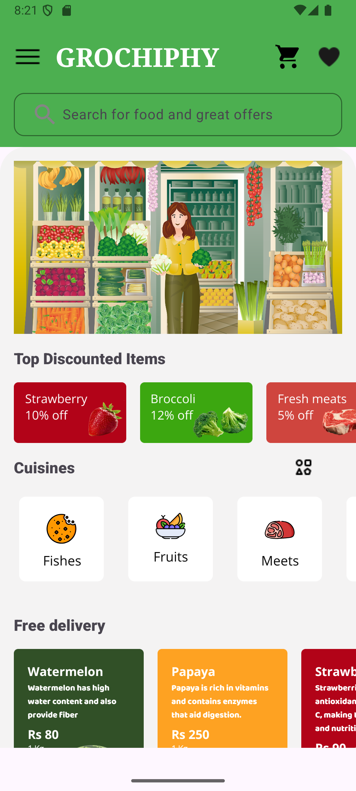
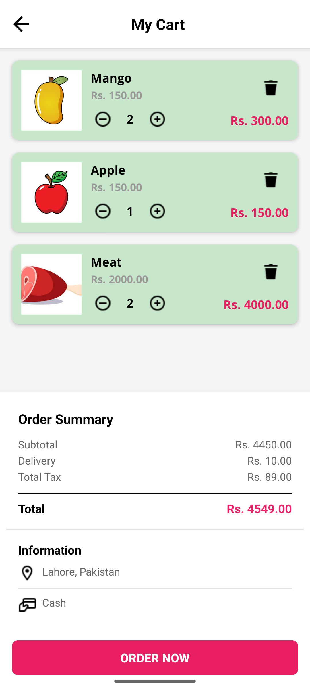
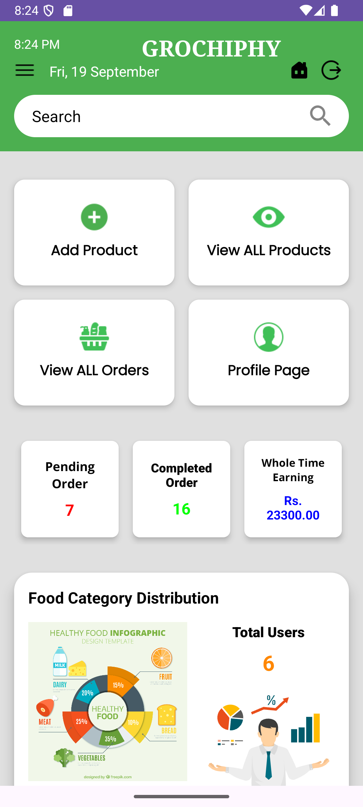
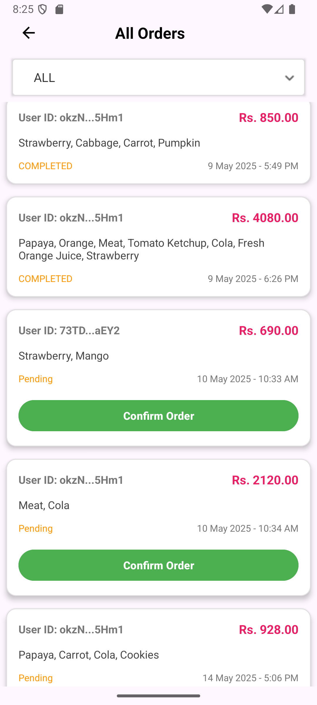
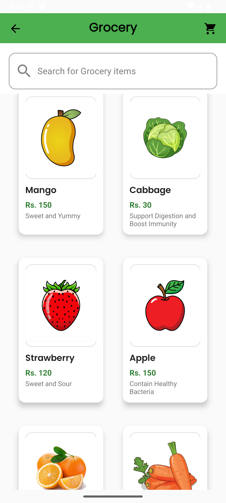
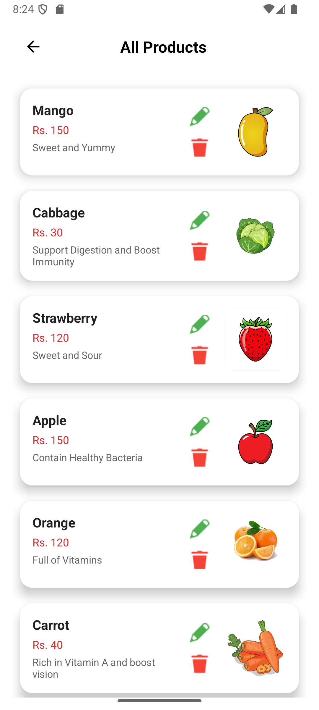

🛒 Grociphy – Smart Grocery App
Grociphy is a smart and modern grocery shopping app built in Java and XML using Android Studio. It delivers a complete shopping experience for both customers and admins, featuring Google Sign-In, real-time cart & order management, Cloudinary-powered image uploads, and a Firebase backend for seamless integration and performance.

📱 Core Features
👥 Customer Side
🔍 Browse groceries with images and categories
❤️ Add products to Wishlist
🛒 Add to Cart and place orders
🔐 Sign in via Email & Google (Firebase Authentication)
👤 View & edit personal profile
📦 View order history and track current orders
🧑‍💼 Admin Panel
➕ Add / ✏️ Edit / 🗑️ Delete products
📁 Upload product images using Cloudinary
👥 View and manage registered users
📦 View and confirm customer orders
📊 Admin dashboard showing real-time stats (orders, income, etc.)
📑 Generate and view daily/monthly order reports
🔐 Authentication
✅ Email & Password via Firebase Authentication
✅ Google Sign-In using Firebase OAuth
🔄 Secure real-time session handling
☁️ Cloudinary Integration
🌄 Host and deliver product images through Cloudinary CDN
⚡ Optimized performance and fast image loading
🔗 Product image URLs stored in Firestore for display
🧱 Tech Stack
Technology	Purpose
Java (Android)	Mobile app development
XML	UI design layout
Firebase Auth	Login / Registration (Email + Google)
Cloud Firestore	Product, User, and Order storage
Firebase Storage (optional)	Image/File backup storage
Cloudinary	Product image hosting and CDN delivery
Glide	Efficient image loading in app
🖼️ Screenshots
home_page cart admin_page edit_delete product_page completed_pending_orders 

## 📸 Screenshots  

## 📸 Screenshots  

   
  

   
  

   
  

